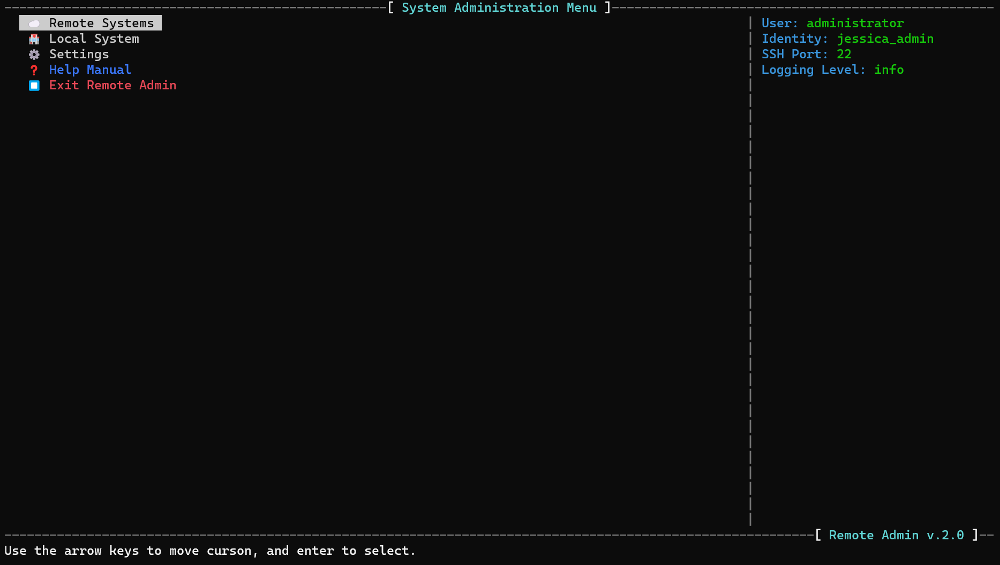
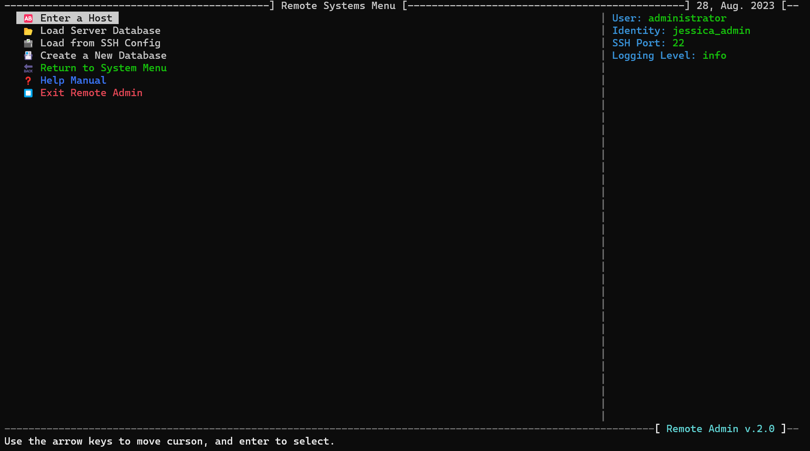
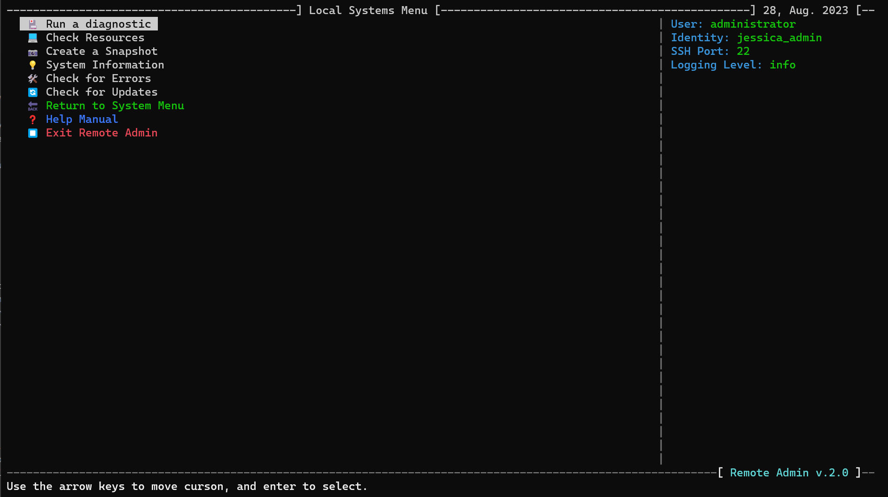
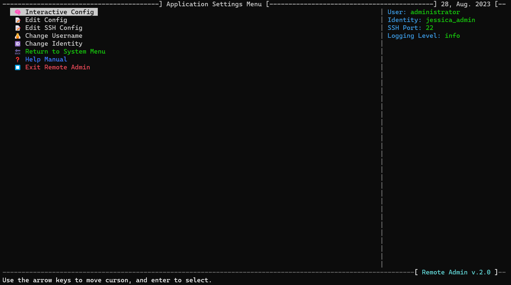
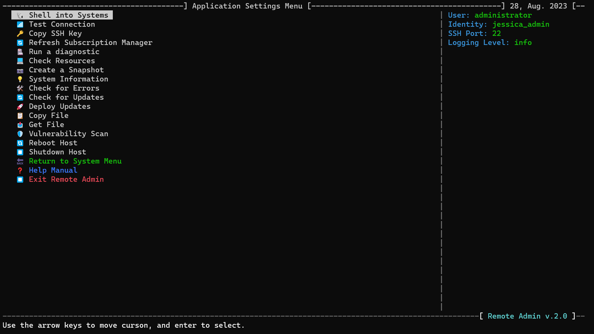
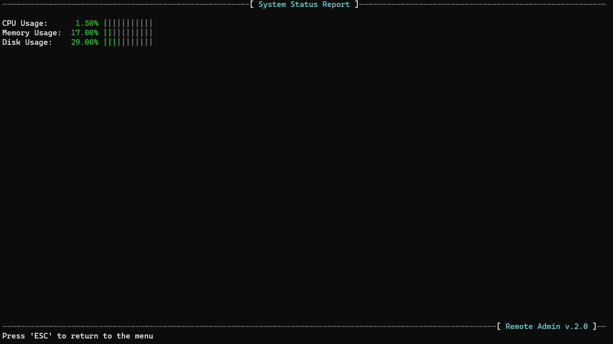
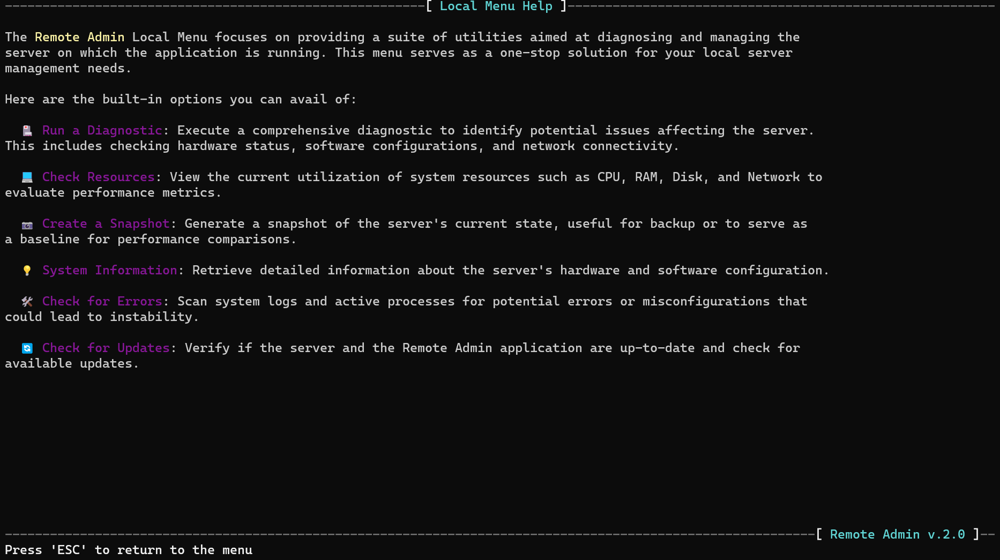

# 🏹 ARROW 2.0 - A Glimpse into Empowered Remote Server Management

## Table of Contents

- [Overview](#overview)
- [wiki](https://github.com/girls-whocode/remote_admin/wiki)
- [Main Menu](#main-menu)
- [Remote Systems Menu](#remote-systems-menu)
- [Local Systems Menu](#local-systems-menu)
- [Application Settings Menu](#application-settings-menu)
- [Action Menu](#action-menu)
- [Screenshots](#screenshots)
- [Support and Contributions](#support-and-contributions)
- [Menu Map](documents/menu_map.md)

---
Welcome to the world of **A**dvanced **R**emote **R**esource and **O**perations **W**orkflow (--/ARROW/==>) 2.0 — where efficiency meets empowerment, and system management becomes a nuanced art. Our application is your conduit to a streamlined, tailored, and effective approach to server administration.

## Overview: Navigating the Alpha State

**NOTE 1:** As you explore this interface, bear in mind that it's in an EXTREME ALPHA state. Many functions are yet to be developed or fully operational. Being crafted to elevate my professional responsibilities, I [commit](https://github.com/girls-whocode/remote_admin/commits/main) to daily updates. Last update: [OCT. 26th, 2024]

**NOTE 2:**
I have resolved most of the following issues in the local menu. The System Information and Check Errors are mostly completed. Through testing is recommended and post any issues that may need to be addressed. I will continue to work towards improvements and features. Over the next few months, I will primarily start working on the local menu. There are many items that I have missed due to the need of my remote operations.

**NOTE 3:**
I have also added a change log section to the bottom of this document to see what fixes, and changes I have done. 

**NOTE 4:**
Over the next year I will start adding Ansible and Puppet features for administrators to build and use.

---
ARROW 2.0 stands as a comprehensive utility tailor-made for system administrators. It's designed to facilitate remote management of servers and local systems, presenting a sleek menu-driven interface for an effortless experience.

## Prerequisites: Pathways to Access

The journey to ARROW 2.0 begins in a Bash shell environment, 5.16 to be exact. Ensure this prerequisite is met to fully engage with the application's potential.

## Usage: The Pathway to Empowerment

Liberate the power of control by invoking the "./ra.sh" command, the key to unlocking a multitude of functionalities.

### Features Await

* Remote and local system diagnostics, resources, and error processing
* SSH key management
* Monitoring of system resources, and errors
* Auto/Auto and Auto/Manual server updates
* Vulnerability scans

---

## Main Menu: Guiding Your Hand

- **Remote Systems**: Traverse to the 'Remote Systems Menu'.
- **Local System**: Progress to the 'Local Systems Menu'.
- **Settings**: Tailor application settings.
- **Help Manual**: Access the inbuilt help manual.
- **Exit**: Bid adieu to the ARROW application.

---

## Remote Systems Menu: Bridging Distances

- **Enter a Host**: Provide the hostname for ARROW to perform actions on.
- **Load Server Database**: Infuse an existing server database.
- **Load from SSH Config**: Inhale hosts from SSH configuration.
- **Create a New Database**: Forge a novel server database.
  
---

## Local Systems Menu: Unveiling Local Marvels

- **Run a Diagnostic**: Initiate diagnostic tests on the local system.
- **Check Resources**: Monitor the heartbeat of system resources.
- **Create a Snapshot**: Capture a snapshot of the system's state.
- **System Information**: Delve into intricate system details.

---

## Application Settings Menu: Fine-Tuning Experience

- **Interactive Config**: Engage the interactive configuration menu.
- **Edit Config**: Manually shape the config file.
- **Edit SSH Config**: Manually sculpt the SSH configuration.
- **Change Username**: Revise the SSH connection's username.
- **Change Identity**: Modify the identity file for SSH connections.

---

## Action Menu: Unleashing Command

- **Shell into Systems: Securely connect via SSH to selected remote systems.
- **Test Connection**: Validate the connection to the remote host.
- **Copy SSH Key**: Dispatch your SSH key to the remote host.
- **Refresh Subscription Manager**: Renew the remote system's subscription manager.
- **Deploy Updates**: Dispatch security patches to remote systems.
- **Copy File**: Convey a file to the remote host.
- **Get File**: Retrieve a file from the remote host.
- **Vulnerability Scan**: Initiate a comprehensive vulnerability scan on the remote host.
  
---

## Screenshots

---

## Support and Contributions: Nurturing Progress

For guidance, consult the built-in Help Manual or raise an issue. Contributions are an embrace; feel free to present pull requests to become part of the journey.

### Development: Crafting in Bash Symphony

ARROW thrives in the realm of BASH, meticulously designed for minimalism and independence from third-party tools. The application, as of BASH version 5.1.16, stands unburdened by external software, championing the philosophy of streamlined and self-sufficient operation.

### Development Environment

Primary Development: Ubuntu
Deployment Target: RHEL 8

### Compatibility Aspiration

Our vision is broad—striving to embrace diverse shell environments beyond BASH. We aspire to extend compatibility to ZSH, FSH, ASH, and beyond, fostering ARROW's utility for administrators across shell preferences.

### The Harmonious Note of Contributions

Those versed in these environments are invited to fork the repository, contributing pull requests to propel us toward our compatibility ambitions.

## Contributing to ARROW 2.0: Your Pathway

Join the symphony of advancement! If enhancing ARROW captivates you, myriad avenues await your contributions. Here's a guide to orient your journey:

### Getting Started

**Fork the Repository**: Visit the ARROW GitHub Repository and click "Fork" on the upper right.

**Clone Your Fork**: In the command line, run git clone https://github.com/your-github-username/Remote-Admin.git.

**Add Upstream**: Connect the original repository as an upstream source: git remote add upstream https://github.com/original-github-username/Remote-Admin.git.

### Crafting Changes

**Create a New Branch**: Begin with a new branch via git checkout -b name-of-your-new-branch.

**Implement Changes**: Sculpt your changes within this branch.

**Run Tests**: Ensure functionality remains intact by running tests.

**Commit Changes**: Share your changes with descriptive commit messages.

**Pull Latest Upstream**: Align with the main project: git pull upstream master.

**Resolve Conflicts**: Tackle any merge conflicts that arise.

### Proposing a Pull Request

**Push Changes**: Transfer your changes to your forked repository on GitHub.

**Open a Pull Request**: Reach the "Pull requests" tab in the original GitHub repository and click "New Pull Request".

**Select Branch**: Designate your branch with changes.

**Detail Changes**: Offer a detailed account of your enhancements.

**Submit**: Click "Create pull request."

### The Review Ensemble

After submitting your pull request, our team reviews your contribution. Feedback may lead to adjustments. Upon acceptance, your changes will harmonize with the main codebase.

## Change Log

10/26/2024: Using ChatGPT to help with the documentation and standardization of function descriptions.

10/26/2024: Started creating more documents located in the Documents folder of this application.

10/26/2024: Redesigned setup_action function to be more universal for all functions

10/26/2024: Moved all setup_action calls to use new redesigned function

10/18/2024: Added script to test if Arrow is already running and abort new instance.

10/15/2024: Working on adding sensor data to System Information page. We need to determine if sensors library is install, if so then use it, if not then ignore it.

10/14/2024: Added spark to modules ramod_spark.sh (https://github.com/holman/spark) to include beautiful graphs

10/14/2024: Started new Internet Speed Test System ra_inetspeed.sh

10/12/2024: Moved vulnerability scanner to ra_scanner.sh

10/12/2024: Added new function has_sudo in ra_sudo.sh

10/12/2024: Small issue with adding strings inside printf resolved in ra_system_info.sh

10/12/2024: Added Change Log section to README.md for quick access

10/12/2024: Fixed color bugs in Local Settings -> System Information screen.

10/12/2024: Removed redundant echos in shell commands in system_info.sh

10/10/2024: Moved SSH Key Management into Remote Menu

10/10/2024: Reduced minimum screen height requirements from 45 to 30

## To Do

A BUNCH!

## License

This script is licensed under MIT License.
