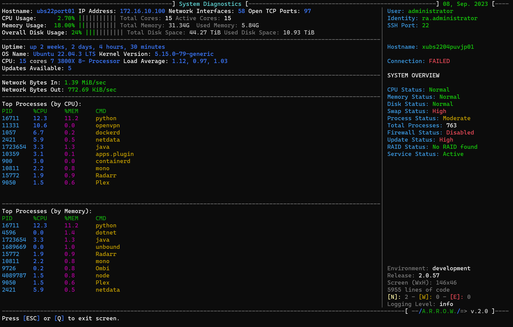

# Remote Admin (v2.0)

## Table of Contents

- [Overview](#overview)
- [Main Menu](#main-menu)
- [Remote Systems Menu](#remote-systems-menu)
- [Local Systems Menu](#local-systems-menu)
- [Application Settings Menu](#application-settings-menu)
- [Action Menu](#action-menu)
- [Screenshots](#screenshots)
- [Support and Contributions](#support-and-contributions)
- [Menu Map](documents/menu_map.md)

---

## Overview
[NOTE *]: It is important to know, this is in EXTREME ALPHA State, most functions are not working, or have not been developed. Because I am building this for my job, I will be updating this daily. Last update: [AUG, 28th, 2023]

Remote Admin is a comprehensive tool designed for system administrators to remotely manage servers and local systems. Utilizing a sleek, menu-driven interface, the application allows you to perform various tasks with ease.

## Prerequisites
Bash shell environment

## Usage
./ra.sh

**Features:**
- Remote and local system diagnostics
- SSH key management
- System resource monitoring
- Automated updates
- Vulnerability scans

---

## Main Menu

- **Remote Systems**: Navigate to the 'Remote Systems Menu'.
- **Local System**: Navigate to the 'Local Systems Menu'.
- **Settings**: Configure application settings.
- **Help Manual**: Access the built-in help manual.
- **Exit**: Close the Remote Admin application.

---

## Remote Systems Menu

- **Enter a Host**: Input the hostname for remote administration.
- **Load Server Database**: Import a pre-existing server database.
- **Load from SSH Config**: Load hosts from your SSH configuration.
- **Create a New Database**: Create a new server database.
  
---

## Local Systems Menu

- **Run a Diagnostic**: Run diagnostic tests on your local system.
- **Check Resources**: Monitor system resources.
- **Create a Snapshot**: Create a system snapshot.
- **System Information**: View detailed system information.

---

## Application Settings Menu

- **Interactive Config**: Use the interactive configuration menu.
- **Edit Config**: Manually edit the config file.
- **Edit SSH Config**: Manually edit the SSH configuration.
- **Change Username**: Update the username for SSH connections.
- **Change Identity**: Update the identity file for SSH connections.

---

## Action Menu

- **Shell into Systems**: SSH into selected remote systems.
- **Test Connection**: Test connection to the remote host.
- **Copy SSH Key**: Send your SSH key to the remote host.
- **Refresh Subscription Manager**: Refresh the remote system's subscription manager.
- **Deploy Updates**: Push security patches to remote systems.
- **Copy File**: Copy a file to the remote host.
- **Get File**: Retrieve a file from the remote host.
- **Vulnerability Scan**: Perform a vulnerability scan on the remote host.
  
---

## Screenshots

---

## Support and Contributions

For support, please refer to the built-in Help Manual or open an issue. Contributions are welcome; please open a pull request to contribute.

---

## Development

Remote Admin is developed entirely in BASH, optimized for minimalism and independence from third-party utilities. As of BASH version 5.1.16, the application requires no additional software, adhering to a philosophy of streamlined and dependency-free operation.

### Development Environment

- **Primary Development**: Ubuntu
- **Deployment Target**: RHEL 8

### Compatibility Goals

The goal is to ensure universal compatibility across various shell environments, extending beyond BASH to include ZSH, FSH, ASH, and others. This initiative aims to make Remote Admin a versatile tool for system administrators, irrespective of their preferred shell environment.

### Contributions

Contributors proficient in these or similar environments are highly encouraged to fork the repository and submit pull requests to assist in achieving this compatibility goal.

## Contributing to Remote Admin 2.0

We are excited to have you contribute to Remote Admin! If you're interested in improving Remote Admin, there are many ways to contribute. Below are some guidelines to follow:

### Getting Started

1. **Fork the Repository**: Navigate to [Remote Admin GitHub Repository](https://github.com/your-github-username/Remote-Admin) and click on the "Fork" button in the upper right corner.
  
2. **Clone Your Fork**: Open your command line and run `git clone https://github.com/your-github-username/Remote-Admin.git`.

3. **Add Upstream**: Add the original repository as an upstream repository by running `git remote add upstream https://github.com/original-github-username/Remote-Admin.git`.

### Making Changes

1. **Create a New Branch**: Before making any changes, create a new branch using `git checkout -b name-of-your-new-branch`.

2. **Make Your Changes**: Implement your changes on this branch.

3. **Run Tests**: Make sure your changes do not break any functionality by running tests.

4. **Commit Changes**: Commit your changes using a descriptive commit message.

5. **Pull Latest Upstream**: Update your local repository with the most recent changes from the main project by running `git pull upstream master`.

6. **Resolve Conflicts**: If there are any merge conflicts, resolve them.

### Submitting a Pull Request

1. **Push Changes**: Push your changes to your forked repository on GitHub.

2. **Create a Pull Request**: Navigate to the "Pull requests" tab in the original GitHub repository and click on the "New Pull Request" button.

3. **Choose Branch**: Select the branch that contains your changes.

4. **Describe Changes**: Provide a detailed description of the changes you made.

5. **Submit**: Click on "Create pull request".

### Review Process

After submitting your pull request, the project maintainers will review your contribution. You may receive feedback and be asked to make changes. Once your pull request is accepted, your changes will be merged into the main codebase.

## License
This script is released under the MIT License.